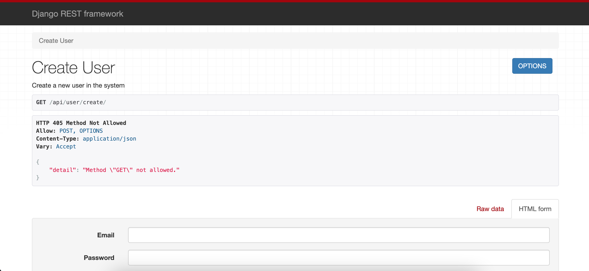

# Recipe API App



> A Postgres backed REST API built using Django REST Framework.

---

### Table of Contents

- [Recipe API App](#recipe-api-app)
    - [Table of Contents](#table-of-contents)
  - [Description](#description)
      - [Technologies](#technologies)
  - [How To Use](#how-to-use)
    - [Installation](#installation)
  - [References](#references)
  - [Author Info](#author-info)

---

## Description

This project is from the Udemy course "Build a Backend REST API with Python and Django - Advanced" by Mark Winterbottom and Brooke Rutherford. It is a REST API that can store and list recipes, their ingredients, and any associated tags. It requires user authentication and is most easily interacted with via the default Django REST Framework pages. (I recommend using an extension like Chrome's [ModHeader](./recipe-api-app_ModHeaderEx.png) to handle setting the HTTP Authorization header)

#### Technologies

- Django REST Framework
- Postgres
- Docker

[Back To The Top](#recipe-api-app)

---

## How To Use

This project is currently deployed using Docker on a Heroku free-tier dyno.

It can be viewed live at [atummillo-recipe-api.herokuapp.com/api/user/create/](https://atummillo-recipe-api.herokuapp.com/api/user/create/)
- (The site may take up to 15 seconds to load if the server has not been contacted in a while)

1. At [atummillo-recipe-api.com/api/user/create/](https://atummillo-recipe-api.herokuapp.com/api/user/create/) input an email, password, and name for your user.
2. Visit [atummillo-recipe-api.com/api/user/token/](https://atummillo-recipe-api.herokuapp.com/api/user/token/) and enter your email and password from the previous step.
3. Record the token returned, and config ModHeader to look like this (substituting your personal token of course)


You should now be authorized to make GET and POST requests at the endpoints 
- [atummillo-recipe-api.herokuapp.com/api/recipe/recipes/](https://atummillo-recipe-api.herokuapp.com/api/recipe/recipes/)
- [atummillo-recipe-api.herokuapp.com/api/recipe/ingredients/](https://atummillo-recipe-api.herokuapp.com/api/recipe/ingredients/)
- [atummillo-recipe-api.herokuapp.com/api/recipe/tags/](https://atummillo-recipe-api.herokuapp.com/api/recipe/tags/)

### Installation
- Make sure you have both Git and Docker installed on your machine.
```unix
    git clone https://github.com/ATummillo/recipe-api-app.git
    cd recipe-api-app
    docker-compose up
```
The site should now be live at [localhost:8000/api/user/create/](http://localhost:8000/api/user/create/)

[Back To The Top](#recipe-api-app)

---

## References

["Build a Backend REST API with Python & Django - Advanced"](https://www.udemy.com/course/django-python-advanced/) by Mark Winterbottom and Brooke Rutherford

[Back To The Top](#recipe-api-app)

---

## Author Info

- Personal Website - [anthonytummillo.com](https://anthonytummillo.com)
- Codepen - [codepen.io/ATummillo](https://codepen.io/ATummillo/)
- LinkedIn - [linkedin.com/in/anthonytummillo](https://www.linkedin.com/in/anthonytummillo/)
- Email - atummillo.dev@gmail.com

[Back To The Top](#recipe-api-app)